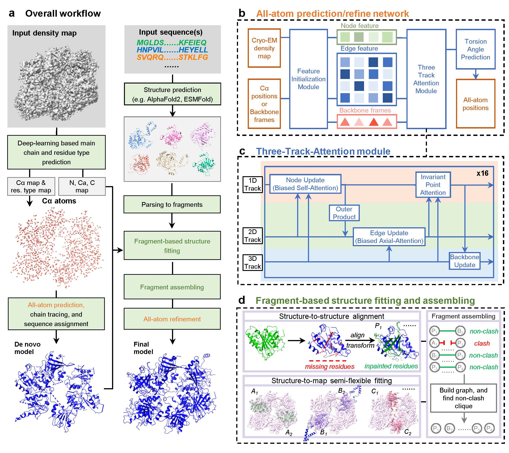

# EMProt

## Overview
EMProt is a software for automatic protein modeling from cryo-EM density maps. Besides accurate *de novo* modeling, it can also integrate predicted (e.g. AlphaFold2/3, ESMFold) structures for improving overall completeness.



## Quick trial on Google Colab
We provide a demo case on the Google Colab for a quick trial, check it [here](https://colab.research.google.com/drive/1fNXGIvLCOjpb5Us-GdnR3Pib2vFZR6Gb?usp=sharing).

## Requirements
**Platform**: Linux (Mainly tested on CentOS 7).

**GPU**: A GPU with >10 GB memory is required, advanced GPU like A100 is recommended.

## Installation
#### 0. Install conda

We use conda to manage the required packages, if it is not installed, please refer to https://docs.anaconda.net.cn/miniconda/install/ for installation.

#### 1. Download EMProt

Download EMProt via github
```
git clone https://github.com/huang-laboratory/EMProt.git
cd EMProt
# if you do not have git, download the zipped file
# wget https://github.com/huang-laboratory/EMProt/archive/refs/heads/main.zip
# unzip main.zip
# cd EMProt-main
```

<!--
alternatively, you can also download it from Huanglab's website
```
wget http://huanglab.phys.hust.edu.cn/EMProt/EMProt.tgz
tar -zxvf EMProt.tgz
cd EMProt
```
-->

#### 2. Create conda environment
```
conda env create -f environment.yml
```
If conda fails, you could install the packages youself. Basically. you can first create an environment named `emprot` by `conda env create -n emprot python=3.10`, then install the packages listed in `environment.yml` using conda or pip.

#### 3. Install EMProt
```
conda activate emprot
pip install -e .
# for executable binaries
chmod +x emprot/bin/*
```
Please do include `-e` in the command. If this command fails to install emprot, remove the emprot env, create a new emprot env and try again.

#### 4. Download the pretrained weights
```
cd emprot
http://huanglab.phys.hust.edu.cn/EMProt/pretrained_weights/weights.tgz
tar -zxvf weights.tgz
# remove the zipped file as needed
# rm -f weights.tgz
```

#### 5. Check if EMProt is installed successfully
```
emprot --version
emprot build --help
```
If no error is encontered, the installation is successful.


## Usage
Running EMProt is very straight forward with one command like
```
emprot build --map MAP.mrc \
    --output OUT \
        --device GPUID \ # default is 0
    [--seq SEQ.fa] \
        [--chain T1.pdb T2.pdb T3.pdb ... ] # also supports mmcif
```
- Cryo-EM density map and output directory is **required**.
- Sequence(s) and predicted models are **optional**.
- Input Fasta file SEQ.fa could include multiple (>= 1) sequences.
- Each PDB/mmCIF file TX.pdb should contain **only** 1 chain.
- If you launch > 1 modeling jobs, the output directory **MUST** be set differently.

The output model (named **output.cif**) will be saved in the specified output directory. Besides the final model, we also provide the *<b>de novo</b>* model named **output_denovo.cif** and the **fitted** model named **output_fit.cif**.

**Check the command usage any time you forget how to run EMProt**
```
emprot build --help
```
The following shows examples for running with different configurations.

#### 1. Modeling with target sequence(s)
We provide an example for users, download it from our website
```
wget http://huanglab.phys.hust.edu.cn/EMProt/examples/v1.1/7UZE.tgz
tar -zxvf 7UZE.tgz
cd 7UZE
```
Then run EMProt
```
emprot build --map 7UZE.mrc --seq 7UZE.fa --device 0 --output out_new
```

#### 2. Modeling without target sequence(s)
EMProt also supports modeling without sequence(s), using the same example, run EMProt with
```
emprot build --map 7UZE.mrc --device 0 --output out_new_no_seq
```

#### 3. Modeling with target sequence(s) and predicted model(s)
Download another example (the predicted AF2 structure for the two chains are included)
```
wget http://huanglab.phys.hust.edu.cn/EMProt/examples/v1.1/8AVV.tgz
tar -zxvf 8AVV.tgz
cd 8AVV
```
Run EMProt with
```
emprot build --map 8AVV.mrc --seq 8AVV.fa --chain 8AVV_A.pdb 8AVV_B.pdb --device 0 --output out_new
```

#### Post refinement
Although EMProt already shows a high backbone and side-chain match to the density map, it is recommended to use third-party programs to further refine the model-map fit and model geometries, e.g. using **phenix.real_space_refine**
```
phenix.real_space_refine 7UZE.mrc out_new/output.cif resolution=2.4
```
This will typically take several minutes.

## Trouble shooting
- **No module named "xxx"**: This means package "xxx" is not successfully installed in your emprot conda environment, use `pip install xxx` or `conda install xxx` to install the missing packages.

- **emprot: command not found...**: This means you are not in the emprot env, use `conda activate emprot` to activate emprot env.
Also, this happens when you do not install emprot main program in the emprot env, use `pip install -e .` to install it.

- **LLVMPY_AddSymbol, version `GLIBCXX_3.4.29`, `CXXABI`, ... , not found, OSError: Could not find/load shared object file**: Too old CXX library version or CXX dynamic library is not found by emprot (this happens for some old operating systems), use `export LD_LIBRARY_PATH=$CONDA_PREFIX/lib/:$LD_LIBRARY_PATH` (when you are in emprot env) to include the libstdc++.so The `$CONDA_PREFIX` is actually where your conda env path is, you can check it by `$ echo $CONDA_PREFIX`. An example path could be `/home/user/conda/envs/emprot`.

- **AssertionError: Egg-link /xxx/emprot.egg-link (to /xxx) does not match installed location of emprot (at /xxx)**: Fail to install EMProt. Solution: remove the `emprot` conda env, create the `emprot` env and install EMProt again.

- We provide some static-compiled binaries (which are compiled under CentOS 7 and Intel CPU) in the EMProt suite, but it does not always fit other platforms, so the following errors may occur. When EMProt fails, either use a new compiled program (with dynamic lib requirement) or compile it from source. Note that the new compiled programs requires some dynamic libs, use `ldd /path/to/EMProt/emprot/bin/recompiled/*` to find what is missing and install the missing libs.

- **Error: cannot convert ca probability map to points, segmentation fault ...**
```
# Use our newly compiled `getp` program (no static, no CPU specific instructions, g++ 4.8.5 with c++11)
cp /path/to/EMProt/emprot/bin/recompiled/getp /path/to/EMProt/emprot/bin/getp

# Or, compile `getp` from source
cd /path/to/EMProt/emprot/bin/srcs/getp
make clean
make
cp getp /path/to/EMProt/emprot/bin/getp
```

- **Error: dockx/domasgx run failed, segmentation fault ...**
```
# For `domasgx`, use our newly compiled `domasgx` program ( no static, no CPU specific instructions, gfortran 4.8.5 ):
cp /path/to/EMProt/emprot/bin/recompiled/domasgx /path/to/EMProt/emprot/bin/domasgx

# For `dockx`, we provide two versions, one compiled using gfortran-4.8.5, and requires libgfortran.so.3 (for older machines like CentOS 7)
# First, check libgfortran version required by the program
ldd /path/to/EMProt/emprot/bin/recompiled/dockx_gfortran_so_*

# If your machine has libgfortran.so.3 (libgfortran.so.5 not found)
cp /path/to/EMProt/emprot/bin/recompiled/dockx_gfortran_so_3  /path/to/EMProt/emprot/bin/dockx

# The other version, compiled using gfortran-8.5.0, and requires libgfortran.so.5 (for newer machines...)
# If your machine has libgfortran.so.5 (libgfortran.so.3 not found)
cp /path/to/EMProt/emprot/bin/recompiled/dockx_gfortran_so_5  /path/to/EMProt/emprot/bin/dockx

# If you dont have both, see our guidance here: /path/to/EMProt/emprot/bin/recompiled/readme
```


## Citation
Tao Li, et al. EMProt improves structure determination from cryo-EM maps. *Nature Structural & Molecular Biology*. 2025
```
@article {EMProt2025,
        title = {EMProt improves structure determination from cryo-EM maps},
        author = {Tao Li, Ji Chen, Hao Li, Hong Cao, Sheng-You Huang},
        journal = {Nature Structural & Molecular Biology},
        year = {2025},
        doi = {}
}
```

